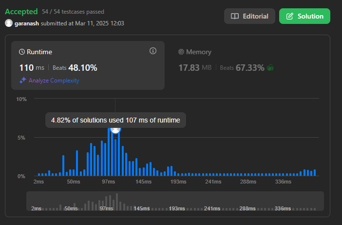

# 1358. Number of Substrings Containing All Three Characters
## Medium

Given a string s consisting only of characters a, b and c.
Return the number of substrings containing at least one occurrence of all these characters a, b and c.

### Example 1:
```python
Input: s = "abcabc"
Output: 10
# Explanation: The substrings containing at least one occurrence of the characters a, b and c are "abc", "abca", "abcab", "abcabc", "bca", "bcab", "bcabc", "cab", "cabc" and "abc" (again).
```
### Example 2:
```python
Input: s = "aaacb"
Output: 3
# Explanation: The substrings containing at least one occurrence of the characters a, b and c are "aaacb", "aacb" and "acb".
```
### Example 3:
```python
Input: s = "abc"
Output: 1
```


### Constraints:

3 <= s.length <= 5 x 10^4  
s only consists of a, b or c characters.


