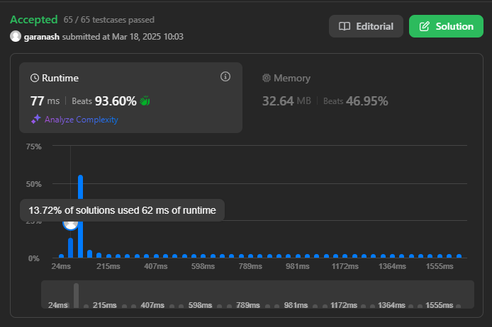

# 2401. Longest Nice Subarray
<hr>

## <span style="color: yellow">Medium</span>

You are given an array nums consisting of positive integers.
We call a subarray of nums nice if the bitwise AND of every pair of elements that are in different positions in the subarray is equal to 0.
Return the length of the longest nice subarray.
A subarray is a contiguous part of an array.
Note that subarrays of length 1 are always considered nice.

## Example 1:
```python
Input: nums = [1,3,8,48,10]
Output: 3
# Explanation: The longest nice subarray is [3,8,48]. This subarray satisfies the conditions:
# - 3 AND 8 = 0.
# - 3 AND 48 = 0.
# - 8 AND 48 = 0.
# It can be proven that no longer nice subarray can be obtained, so we return 3.
```

## Example 2:
```python
Input: nums = [3,1,5,11,13]
Output: 1
# Explanation: The length of the longest nice subarray is 1. Any subarray of length 1 can be chosen.
```

## Constraints:

1 <= nums.length <= 10^5  
1 <= nums[i] <= 10^9  

