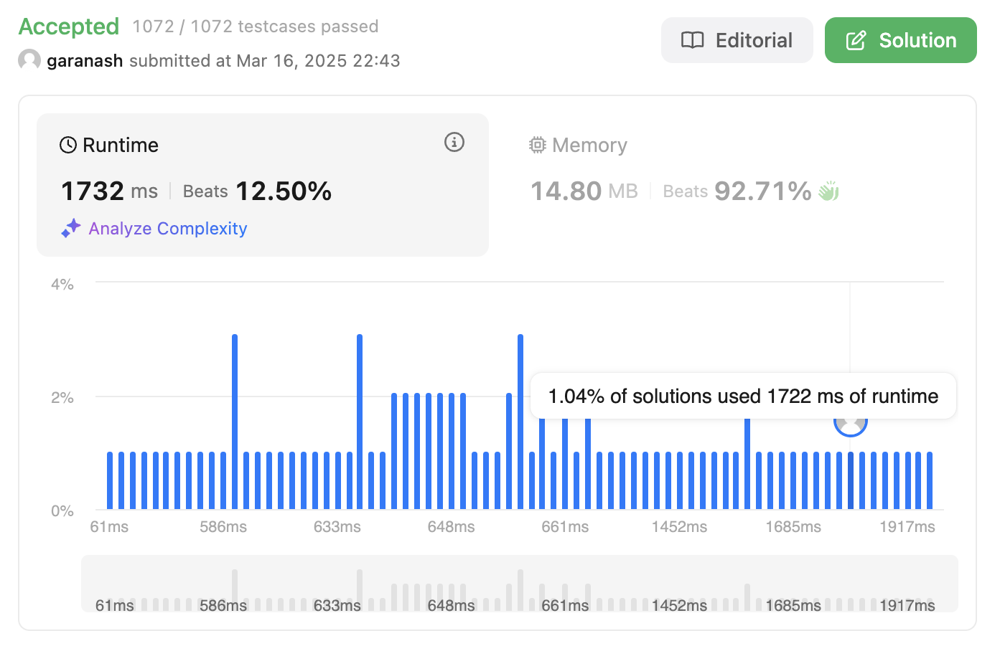

# 2594. Minimum Time to Repair Cars

## <span style="color: yellow">Medium</span>

You are given an integer array ranks representing the ranks of some mechanics. ranksi is the rank of the ith mechanic. A mechanic with a rank r can repair n cars in r * n2 minutes.  
You are also given an integer cars representing the total number of cars waiting in the garage to be repaired.  
Return the minimum time taken to repair all the cars.
Note: All the mechanics can repair the cars simultaneously.

## Example 1:
```python
Input: ranks = [4,2,3,1], cars = 10
Output: 16
# Explanation: 
# - The first mechanic will repair two cars. The time required is 4 * 2 * 2 = 16 minutes.
# - The second mechanic will repair two cars. The time required is 2 * 2 * 2 = 8 minutes.
# - The third mechanic will repair two cars. The time required is 3 * 2 * 2 = 12 minutes.
# - The fourth mechanic will repair four cars. The time required is 1 * 4 * 4 = 16 minutes.
# It can be proved that the cars cannot be repaired in less than 16 minutes.
```

## Example 2:
```python
Input: ranks = [5,1,8], cars = 6
Output: 16
# Explanation: 
# - The first mechanic will repair one car. The time required is 5 * 1 * 1 = 5 minutes.
# - The second mechanic will repair four cars. The time required is 1 * 4 * 4 = 16 minutes.
# - The third mechanic will repair one car. The time required is 8 * 1 * 1 = 8 minutes.
# It can be proved that the cars cannot be repaired in less than 16 minutes.
```

## Constraints:
1 <= ranks.length <= 10^5  
1 <= ranks[i] <= 100  
1 <= cars <= 10^6

