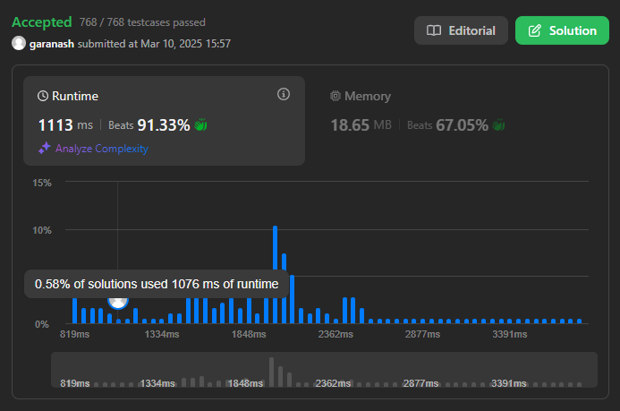

# 3306. Count of Substrings Containing Every Vowel and K Consonants II

## Medium

You are given a string word and a non-negative integer k.  
Return the total number of substrings of word that contain every vowel ('a', 'e', 'i', 'o', and 'u') at least once and exactly k consonants.

### Example 1:
```python
Input: word = "aeioqq", k = 1
Output: 0
# Explanation:
# There is no substring with every vowel.
```
### Example 2:
```python
Input: word = "aeiou", k = 0
Output: 1
# Explanation:
# The only substring with every vowel and zero consonants is word[0..4], which is "aeiou".
```
### Example 3:
```python
Input: word = "ieaouqqieaouqq", k = 1
Output: 3
# Explanation:
# The substrings with every vowel and one consonant are:
# word[0..5], which is "ieaouq".
# word[6..11], which is "qieaou".
# word[7..12], which is "ieaouq".
```
## Constraints:
5 <= word.length <= 2 * 10**5  
word consists only of lowercase English letters.  
0 <= k <= word.length - 5

