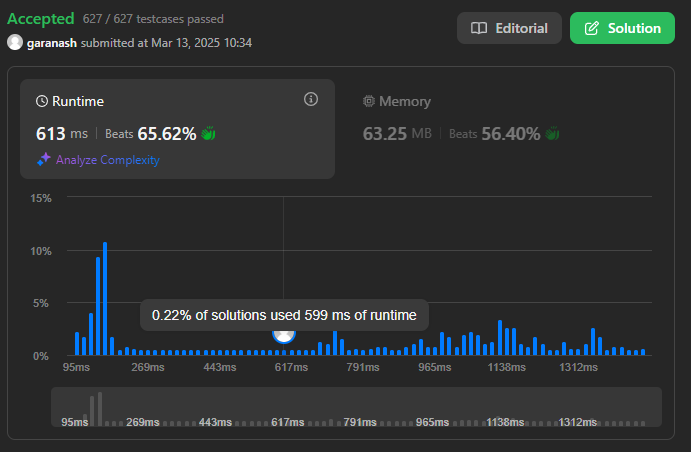

# 3356. Zero Array Transformation II
<hr>

## <span style="color: yellow">Medium</span>

You are given an integer array nums of length n and a 2D array queries where queries[i] = [li, ri, vali].

Each queries[i] represents the following action on nums:  

* Decrement the value at each index in the range [li, ri] in nums by at most vali.  
* The amount by which each value is decremented can be chosen independently for each index.  
* A Zero Array is an array with all its elements equal to 0.  

Return the minimum possible non-negative value of k, such that after processing the first k queries in sequence, nums becomes a Zero Array.  
If no such k exists, return -1.

 

### Example 1:
```python
Input: nums = [2,0,2], queries = [[0,2,1],[0,2,1],[1,1,3]]
Output: 2
# Explanation:
# For i = 0 (l = 0, r = 2, val = 1):
# Decrement values at indices [0, 1, 2] by [1, 0, 1] respectively.
# The array will become [1, 0, 1].
# For i = 1 (l = 0, r = 2, val = 1):
# Decrement values at indices [0, 1, 2] by [1, 0, 1] respectively.
# The array will become [0, 0, 0], which is a Zero Array. Therefore, the minimum value of k is 2.
```

### Example 2:
```python
Input: nums = [4,3,2,1], queries = [[1,3,2],[0,2,1]]
Output: -1
# Explanation:
# For i = 0 (l = 1, r = 3, val = 2):
# Decrement values at indices [1, 2, 3] by [2, 2, 1] respectively.
# The array will become [4, 1, 0, 0].
# For i = 1 (l = 0, r = 2, val = 1):
# Decrement values at indices [0, 1, 2] by [1, 1, 0] respectively.
# The array will become [3, 0, 0, 0], which is not a Zero Array.
```

## Constraints:

1 <= nums.length <= 10**5  
0 <= nums[i] <= 5 * 10**5  
1 <= queries.length <= 10**5  
queries[i].length == 3  
0 <= li <= ri < nums.length  
1 <= vali <= 5  
