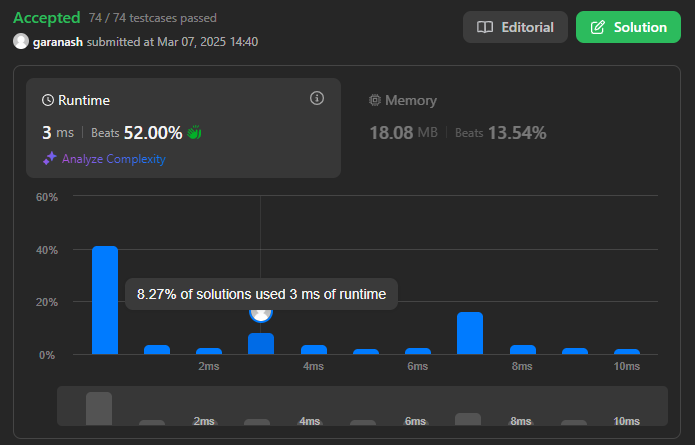

# 1652. Defuse the Bomb

# Easy
You have a bomb to defuse, and your time is running out! Your informer will provide you with a circular array code of length of n and a key k.

To decrypt the code, you must replace every number. All the numbers are replaced simultaneously.

If k > 0, replace the ith number with the sum of the next k numbers.   
If k < 0, replace the ith number with the sum of the previous k numbers.   
If k == 0, replace the ith number with 0.   
As code is circular, the next element of code[n-1] is code[0], and the previous element of code[0] is code[n-1].   

Given the circular array code and an integer key k, return the decrypted code to defuse the bomb!

 

Example 1:
```python
Input: code = [5,7,1,4], k = 3
Output: [12,10,16,13]
# Explanation: Each number is replaced by the sum of the next 3 numbers. The decrypted code is [7+1+4, 1+4+5, 4+5+7, 5+7+1]. Notice that the numbers wrap around.
```

Example 2:
```python
Input: code = [1,2,3,4], k = 0
Output: [0,0,0,0]
# Explanation: When k is zero, the numbers are replaced by 0. 
```

Example 3:
```python
Input: code = [2,4,9,3], k = -2
Output: [12,5,6,13]
# Explanation: The decrypted code is [3+9, 2+3, 4+2, 9+4]. Notice that the numbers wrap around again. If k is negative, the sum is of the previous numbers.
```

### Constraints:

n == code.length  
1 <= n <= 100  
1 <= code[i] <= 100  
-(n - 1) <= k <= n - 1  


