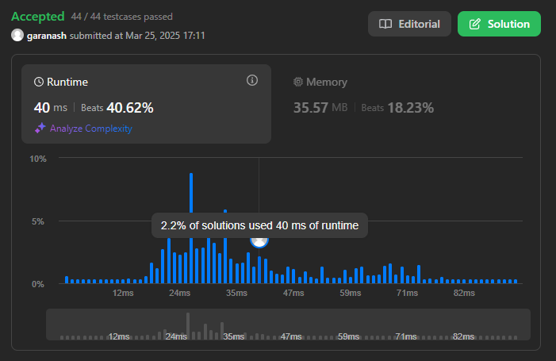

# 2161. Partition Array According to Given Pivot

<hr>

## <span style="color: yellow">Medium</span>

You are given a 0-indexed integer array nums and an integer pivot. Rearrange nums such that the following conditions are satisfied:
* Every element less than pivot appears before every element greater than pivot.
* Every element equal to pivot appears in between the elements less than and greater than pivot.
* The relative order of the elements less than pivot and the elements greater than pivot is maintained.
  * More formally, consider every pi, pj where pi is the new position of the ith element and pj is the new position of the jth element. If i < j and both elements are smaller (or larger) than pivot, then pi < pj.   

<b>Return nums after the rearrangement.</b>

### Example 1:
```python
Input: nums = [9,12,5,10,14,3,10], pivot = 10
Output: [9,5,3,10,10,12,14]
# Explanation: 
# The elements 9, 5, and 3 are less than the pivot so they are on the left side of the array.
# The elements 12 and 14 are greater than the pivot so they are on the right side of the array.
# The relative ordering of the elements less than and greater than pivot is also maintained. [9, 5, 3] and [12, 14] are the respective orderings.
```
### Example 2:
```python
Input: nums = [-3,4,3,2], pivot = 2
Output: [-3,2,4,3]
# Explanation: 
# The element -3 is less than the pivot so it is on the left side of the array.
# The elements 4 and 3 are greater than the pivot so they are on the right side of the array.
# The relative ordering of the elements less than and greater than pivot is also maintained. [-3] and [4, 3] are the respective orderings.
```

## Constraints:

1 <= nums.length <= 10^5  
-10^6 <= nums[i] <= 10^6  
pivot equals to an element of nums.

