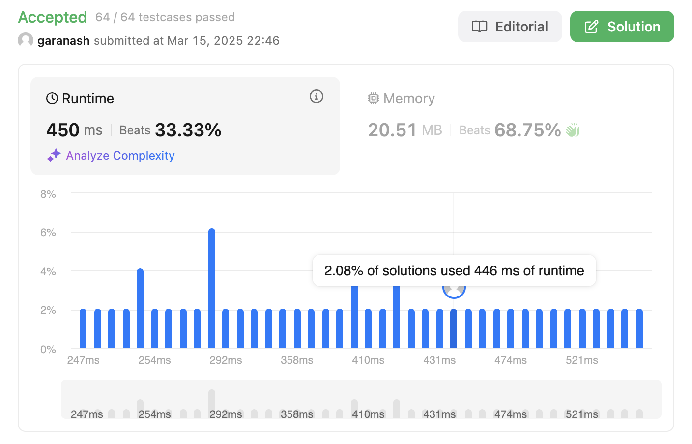

# 2560. House Robber IV

## <span style="color: yellow">Medium</span>

There are several consecutive houses along a street, each of which has some money inside. There is also a robber, who wants to steal money from the homes, but he refuses to steal from adjacent homes.
The capability of the robber is the maximum amount of money he steals from one house of all the houses he robbed.
You are given an integer array nums representing how much money is stashed in each house. More formally, the ith house from the left has nums[i] dollars.
You are also given an integer k, representing the minimum number of houses the robber will steal from. It is always possible to steal at least k houses.
Return the minimum capability of the robber out of all the possible ways to steal at least k houses.

Example 1:
```python
Input: nums = [2,3,5,9], k = 2
Output: 5
# Explanation: 
# There are three ways to rob at least 2 houses:
# - Rob the houses at indices 0 and 2. Capability is max(nums[0], nums[2]) = 5.
# - Rob the houses at indices 0 and 3. Capability is max(nums[0], nums[3]) = 9.
# - Rob the houses at indices 1 and 3. Capability is max(nums[1], nums[3]) = 9.
# Therefore, we return min(5, 9, 9) = 5.
```

Example 2:
```python
Input: nums = [2,7,9,3,1], k = 2
Output: 2
# Explanation: There are 7 ways to rob the houses. The way which leads to minimum capability is to rob the house at index 0 and 4. Return max(nums[0], nums[4]) = 2.
```


## Constraints:

1 <= nums.length <= 10^5  
1 <= nums[i] <= 10^9  
1 <= k <= (nums.length + 1)/2
