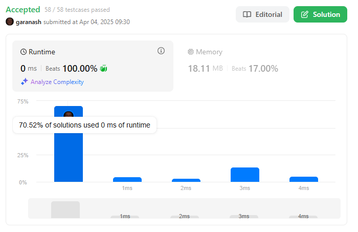

# 865. Smallest Subtree with all the Deepest Nodes

<hr>

## <span style="color: yellow">Medium</span>

Given the root of a binary tree, the depth of each node is the shortest distance to the root.

Return the smallest subtree such that it contains all the deepest nodes in the original tree.

A node is called the deepest if it has the largest depth possible among any node in the entire tree.

The subtree of a node is a tree consisting of that node, plus the set of all descendants of that node.

### Example 1:

```python
Input: root = [3,5,1,6,2,0,8,null,null,7,4]
Output: [2,7,4]
# Explanation: We return the node with value 2, colored in yellow in the diagram.
# The nodes coloured in blue are the deepest leaf-nodes of the tree.
# Note that nodes 6, 0, and 8 are also leaf nodes, but the depth of them is 2, but the depth of nodes 7 and 4 is 3.
```

### Example 2:
```python
Input: root = [1]
Output: [1]
# Explanation: The root is the deepest node in the tree, and it's the lca of itself.
```

### Example 3:
```python
Input: root = [0,1,3,null,2]
Output: [2]
# Explanation: The deepest leaf node in the tree is 2, the lca of one node is itself.
```

## Constraints:
The number of nodes in the tree will be in the range [1, 500].  
0 <= Node.val <= 500  
The values of the nodes in the tree are unique.  


