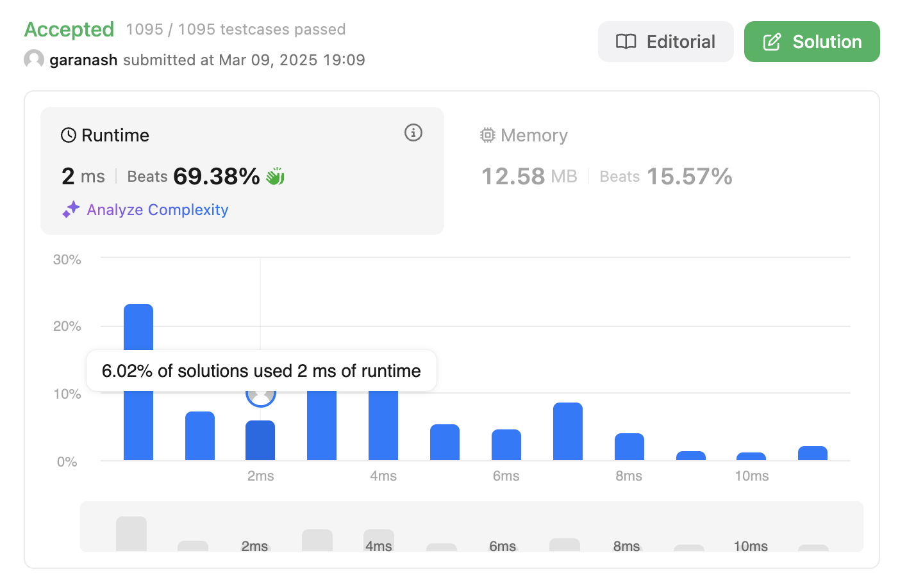

# 8. String to Integer (atoi)
## Medium

Implement the myAtoi(string s) function, which converts a string to a 32-bit signed integer.
The algorithm for myAtoi(string s) is as follows:
* Whitespace: Ignore any leading whitespace (" ").
* Signedness: Determine the sign by checking if the next character is '-' or '+', assuming positivity if neither present.
* Conversion: Read the integer by skipping leading zeros until a non-digit character is encountered or the end of the string is reached. If no digits were read, then the result is 0.
* Rounding: If the integer is out of the 32-bit signed integer range [-2**31, 2**31 - 1], then round the integer to remain in the range. Specifically, integers less than -2**31 should be rounded to -2**31, and integers greater than 2**31 - 1 should be rounded to 2**31 - 1.
Return the integer as the final result.

#### Example 1:
```python
Input: s = "42"
Output: 42
# Explanation:
# 
# The underlined characters are what is read in and the caret is the current reader position.
# Step 1: "42" (no characters read because there is no leading whitespace)
#          ^
# Step 2: "42" (no characters read because there is neither a '-' nor '+')
#          ^
# Step 3: "42" ("42" is read in)
#            ^
```

#### Example 2:
```python
Input: s = " -042"
Output: -42
# Explanation:
# 
# Step 1: "   -042" (leading whitespace is read and ignored)
#             ^
# Step 2: "   -042" ('-' is read, so the result should be negative)
#              ^
# Step 3: "   -042" ("042" is read in, leading zeros ignored in the result)
#                ^
```

#### Example 3:
```python
Input: s = "1337c0d3"
Output: 1337
# Explanation:
# 
# Step 1: "1337c0d3" (no characters read because there is no leading whitespace)
#          ^
# Step 2: "1337c0d3" (no characters read because there is neither a '-' nor '+')
#          ^
# Step 3: "1337c0d3" ("1337" is read in; reading stops because the next character is a non-digit)
#              ^
```

#### Example 4:
```python
Input: s = "0-1"
Output: 0
# Explanation:
# 
# Step 1: "0-1" (no characters read because there is no leading whitespace)
#          ^
# Step 2: "0-1" (no characters read because there is neither a '-' nor '+')
#          ^
# Step 3: "0-1" ("0" is read in; reading stops because the next character is a non-digit)
#           ^
```

Example 5:
```python
Input: s = "words and 987"
Output: 0
# Explanation:
# 
# Reading stops at the first non-digit character 'w'.
```

 

### Constraints:

0 <= s.length <= 200  
s consists of English letters (lower-case and upper-case), digits (0-9), ' ', '+', '-', and '.'.
